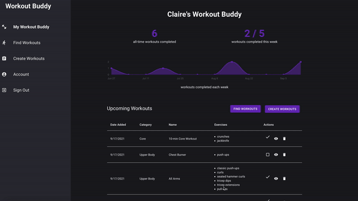

## Workout Buddy

Workout Buddy is an app designed to help users hold themselves accountable to hitting fitness goals. Workout Buddy enables users to keep a personal workout log to plan and track workout activity, selecting from a variety of pre-built workouts as well as creating custom workouts of their own. Users can visualize their progress against their weekly goals in their personal Workout Buddy dashboard.

<br />
<p align="center"></p>

<br />

## Contributors

**Claire Logan**
<br />
github: [clogan1](https://github.com/clogan1)
<br />
email: clairelogan16@gmail.com

**Josh Blengino**
<br />
github: [Jblengino510](https://github.com/Jblengino510)
<br />
email: J.blengino@yahoo.com

**Sam Jomaiv**
<br />
github: [SamJoma](https://github.com/SamJoma)
<br />
email: 


## Built With
This project was built with the following:
- [Ruby on Rails](https://rubyonrails.org/)
- [React](https://reactjs.org/)
- [Material UI](https://mui.com/) (CSS)
- [Chartkick](https://chartkick.com/), [Chart.js](https://www.chartjs.org/)

<br />

## Getting Started
<br />
To run this project locally, run the following commands:
<br />

```javascript
bundle install
npm install --prefix client

rails db:create db:migrate db:seed

rails s
npm start --prefix client
```

## User Stories


- Login in or create a new account (user authentication)
- User can set a weekly workout goal
- View personal My Workout Buddy dashboard, including data on your progress and your workout log


<br />

- View details of a workout in your log, mark a workout as completed, or remove a workout from your log


<br />

- Browse and search workouts to add a new workout to your log


<br />

- Create a custom workout and add it to your log


<br />

- Edit your username, avatar, and weekly goal


